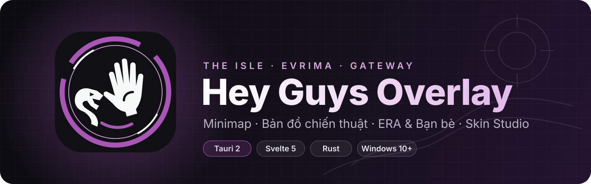
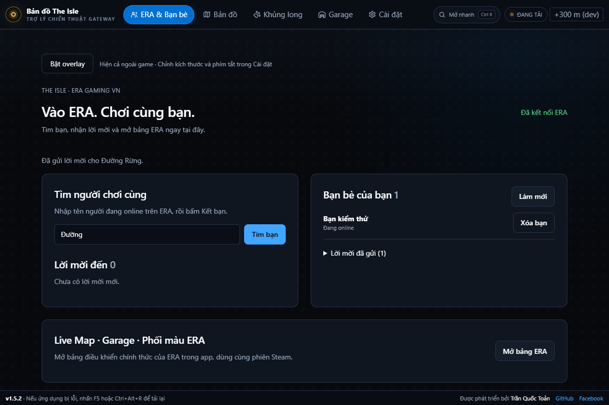
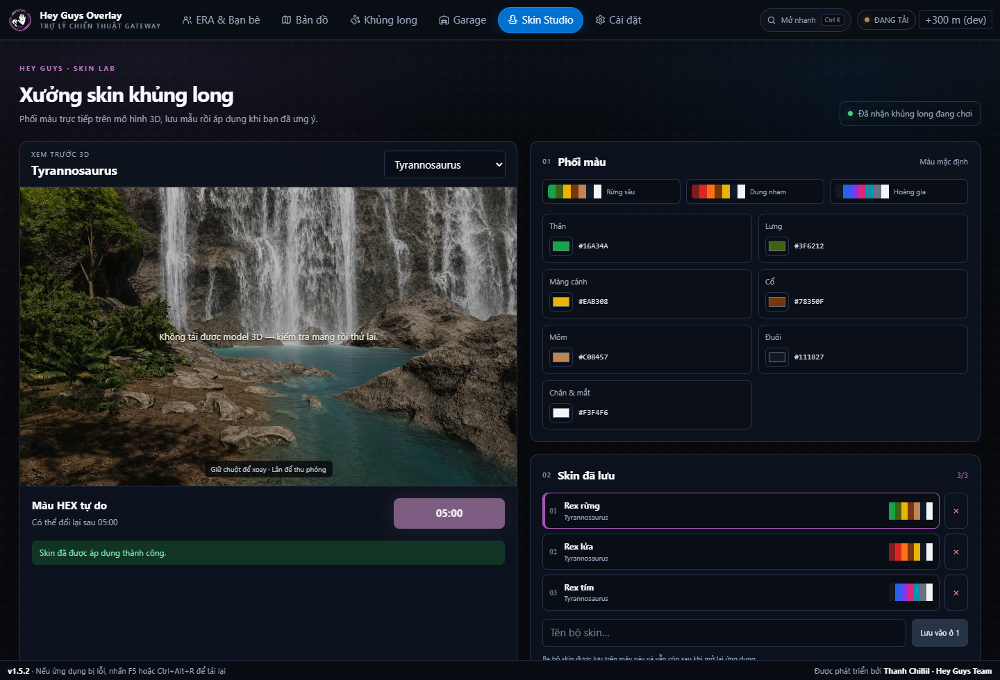
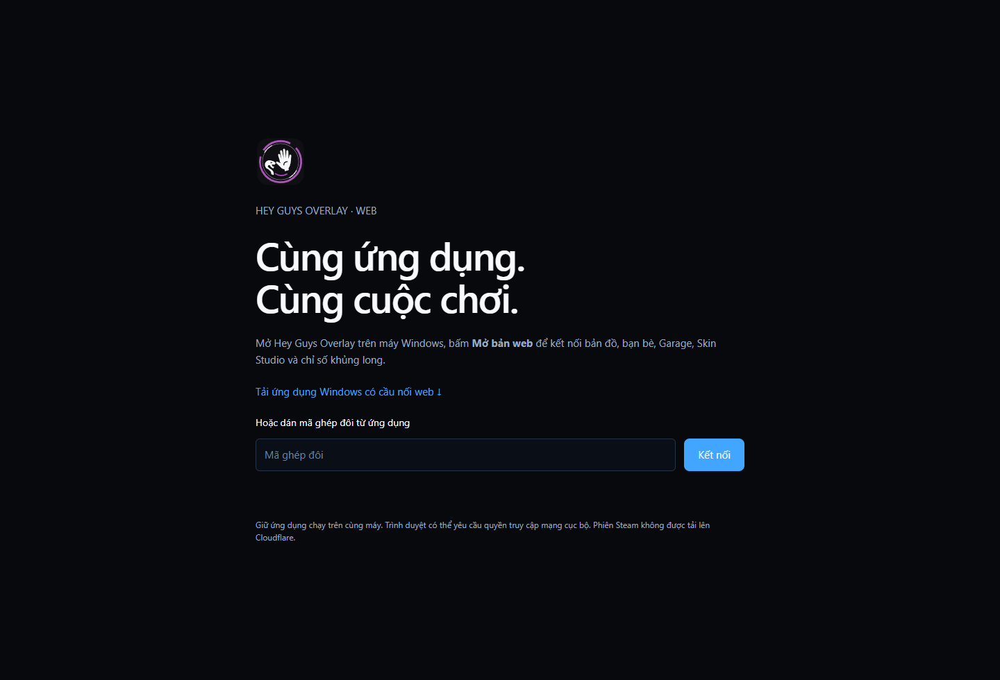

<div align="center">



<br>

**Trợ lý chiến thuật cho The Isle: Evrima (map Gateway)** — minimap đè lên game,
bản đồ lớn nhiều lớp, chỉ số khủng long, Garage 3D, Skin Studio và kết bạn ERA
ngay trong một ứng dụng Windows gọn nhẹ.

<br>

[](CHANGELOG.md)
[](#-cài-đặt)
[](https://tauri.app)
[](https://svelte.dev)
[](https://www.rust-lang.org)

[**🌐 Bản web**](https://heyguys-dashboard.pages.dev/) ·
[**✨ Tính năng**](#-tính-năng) ·
[**📸 Ảnh chụp**](#-ảnh-chụp) ·
[**🛠️ Build**](#️-build-từ-mã-nguồn) ·
[**📜 Nhật ký thay đổi**](CHANGELOG.md)

</div>

---

> [!NOTE]
> Đây là bản **Hey Guys Team** phát triển tiếp từ
> [**toantranct/theisle-overlay**](https://github.com/toantranct/theisle-overlay) của
> **Trần Quốc Toản**. Toàn bộ lịch sử commit gốc được giữ nguyên — xem mục
> [Ghi công](#-ghi-công).

## ✨ Tính năng

<table>
<tr>
<td width="50%" valign="top">

### 🗺️ Bản đồ & minimap
- Minimap tròn **bám cửa sổ game**, chuột bấm xuyên qua
- Bản đồ lớn **12+ lớp** bật/tắt: nước, mỏ muối, khu bảo tồn, vùng di cư, POI server…
- Nền ERA · MyIsleMap / Vulnona / IsleMaps sáng–tối
- Waypoint, tìm địa danh **không dấu**, dán tọa độ để nhảy tới
- Vẽ lại đường đã đi, khung hình **60 Hz** bám v-sync

</td>
<td width="50%" valign="top">

### 🦖 Khủng long & HUD
- Máu, đói, khát, thể lực, dinh dưỡng, **Prime progress**
- **Dino HUD** tách riêng minimap — kéo, đổi cỡ, tự lưu vị trí
- Garage (Gacha) với **model 3D** xoay/phóng, đúng màu skin
- Đăng nhập Steam **một lần** dùng cho mọi server

</td>
</tr>
<tr>
<td valign="top">

### 🤝 ERA & Bạn bè
- Tìm người chơi online, gửi/nhận/từ chối lời mời
- **Đồng đội trên bản đồ**: bám theo, điểm hẹn, xem cả nhóm
- Mở Live Map · Garage · phối màu ERA chính thức trong app, dùng chung phiên

</td>
<td valign="top">

### 🎨 Skin Studio
- Tự nhận loài đang chơi, xem trước màu trên **mô hình 3D**
- Phối **7 vùng màu** theo ERA, 3 preset sẵn
- Lưu tới **3 skin** trên máy, chỉ áp dụng khi bạn bấm xác nhận

</td>
</tr>
<tr>
<td colspan="2" valign="top">

### 🌐 Bản web đồng hành
Bấm **Mở bản web** trong app để điều khiển từ trình duyệt qua cầu nối cục bộ
`127.0.0.1` có mã ghép đôi 256‑bit. Cookie Steam **không bao giờ** rời khỏi máy.
Chi tiết: [`docs/WEB-COMPANION.md`](docs/WEB-COMPANION.md).

</td>
</tr>
</table>

## 📸 Ảnh chụp

<div align="center">


<br><sub><b>Trong game</b> — minimap, chỉ số khủng long và nhiệm vụ Prime đè thẳng lên màn hình</sub>

<br><br>

<table>
<tr>
<td align="center"><br><sub><b>ERA & Bạn bè</b></sub></td>
<td align="center"><br><sub><b>Skin Studio</b></sub></td>
</tr>
<tr>
<td align="center"><br><sub><b>Bản đồ lớn nhiều lớp</b></sub></td>
<td align="center"><br><sub><b>Garage với xem 3D</b></sub></td>
</tr>
<tr>
<td align="center"><br><sub><b>Chỉ số & Prime</b></sub></td>
<td align="center"><br><sub><b>Bản web đồng hành</b></sub></td>
</tr>
</table>

</div>

## 📥 Cài đặt

<div align="center">

[](https://github.com/tailieutruongthanhb3dian-a11y/hey-guys-overlay/releases/latest/download/Hey-Guys-Overlay-Windows.zip)

<sub>Không cần cài đặt · Windows 10/11 64-bit</sub>

</div>

1. Bấm nút **Tải về** ở trên.
2. Chuột phải file ZIP → **Extract All…** (Giải nén tất cả) → **Extract**.
3. Nhấp đúp `Hey-Guys-Overlay.exe` — giữ hai file `.dll` nằm cạnh.
4. Bấm **Kết nối Steam**, đăng nhập một lần. Vào game là overlay tự hiện.

> [!WARNING]
> Nếu Windows hiện màn hình xanh **"Windows protected your PC"**: bấm **More info** → **Run anyway**.
> App chưa có chữ ký số nên Windows cảnh báo, không phải virus.

> [!TIP]
> `Ctrl+K` mở bảng lệnh nhanh · `Ctrl+1…6` chuyển tab · `F5` hoặc `Ctrl+Alt+R` tải lại khi lỗi giao diện.

## 🛠️ Build từ mã nguồn

**Cần có:** Node.js 20+, Rust stable (MSVC), WebView2 Runtime.

```powershell
npm install
npm run tauri dev      # chạy thử
npm run tauri build    # đóng gói bản phát hành
```

<details>
<summary><b>Cấu trúc thư mục</b></summary>

```
src/            Giao diện Svelte 5 (main, minimap, dino-hud)
src-tauri/      Lõi Rust: overlay, ERA, web bridge, telemetry
worker/         Cloudflare Worker (API + dashboard)
scripts/        Script QA tự động bằng Chromium
docs/           Tài liệu thiết kế, tích hợp ERA, ảnh chụp
```

</details>

## 🙏 Ghi công

- **Tác giả gốc:** [Trần Quốc Toản](https://github.com/toantranct) —
  [theisle-overlay](https://github.com/toantranct/theisle-overlay).
  README gốc: [Tiếng Việt](docs/UPSTREAM-README.md) · [English](docs/UPSTREAM-README.en.md).
- **Bản Hey Guys:** Thanh Chillil · Hey Guys Team — ERA & Bạn bè, Skin Studio,
  Dino HUD tách riêng, bản web đồng hành, giao diện mới.
- **Dữ liệu bản đồ:** [VulnonaMAP](https://vulnona.com/game/map/),
  [islemaps.com](https://www.islemaps.com/), [myislemap.com](https://myislemap.com/).

<div align="center">
<sub>Dự án cộng đồng, không liên kết với Afterthought LLC. The Isle là thương hiệu của Afterthought LLC.</sub>
</div>
